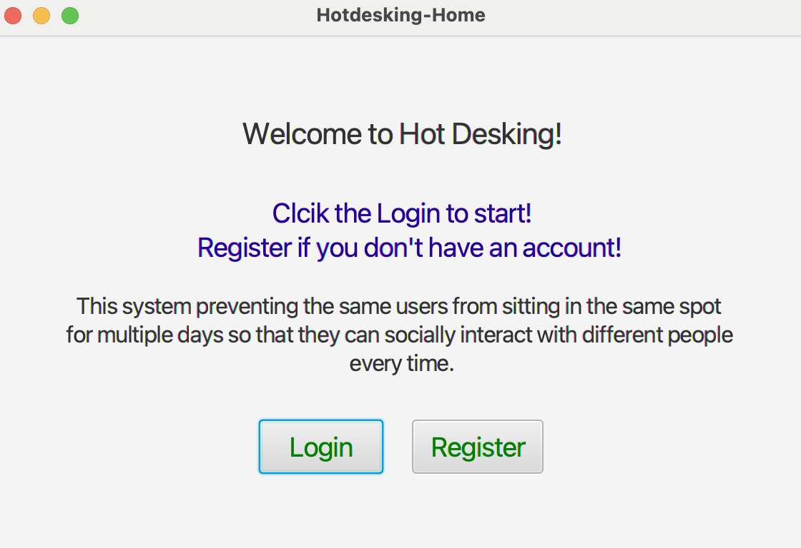
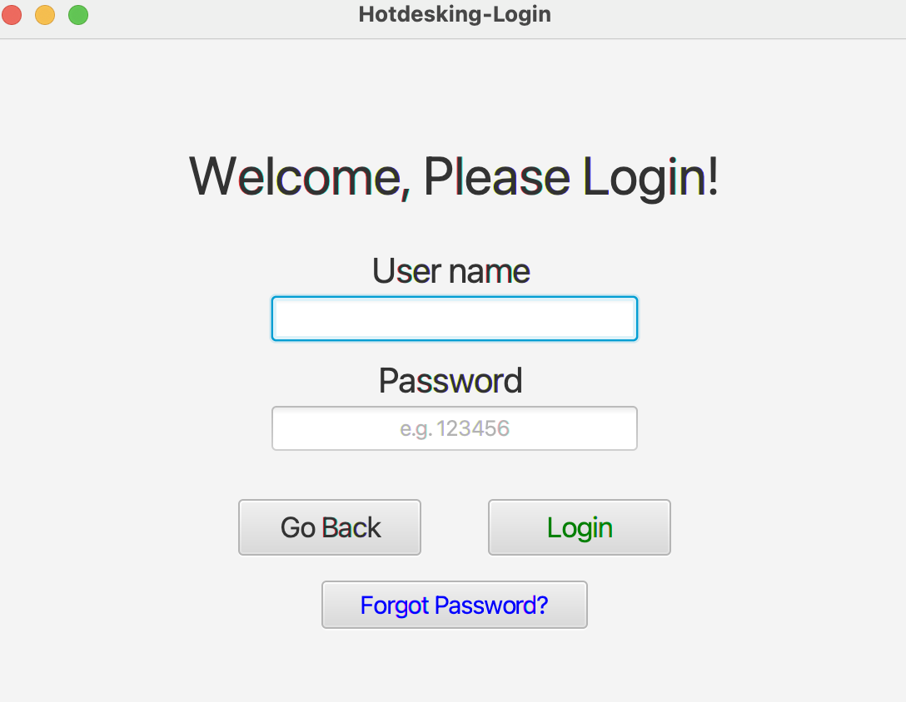
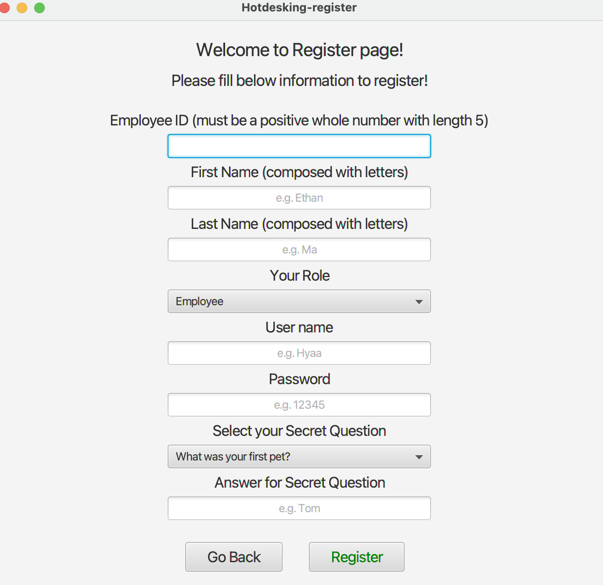
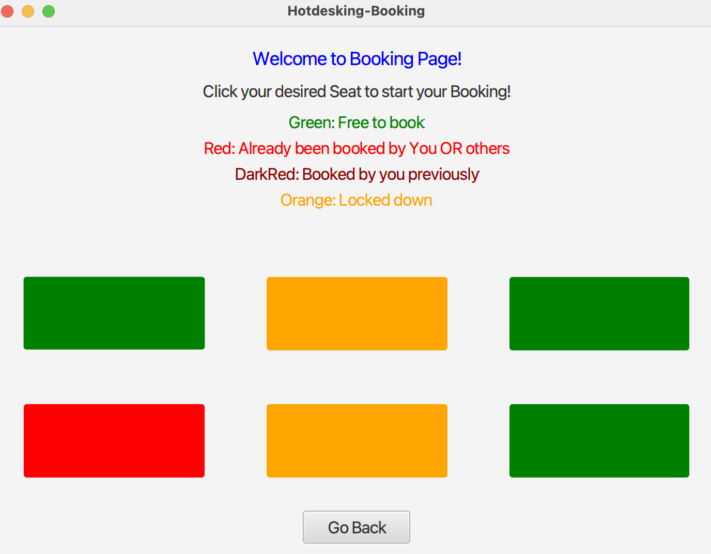
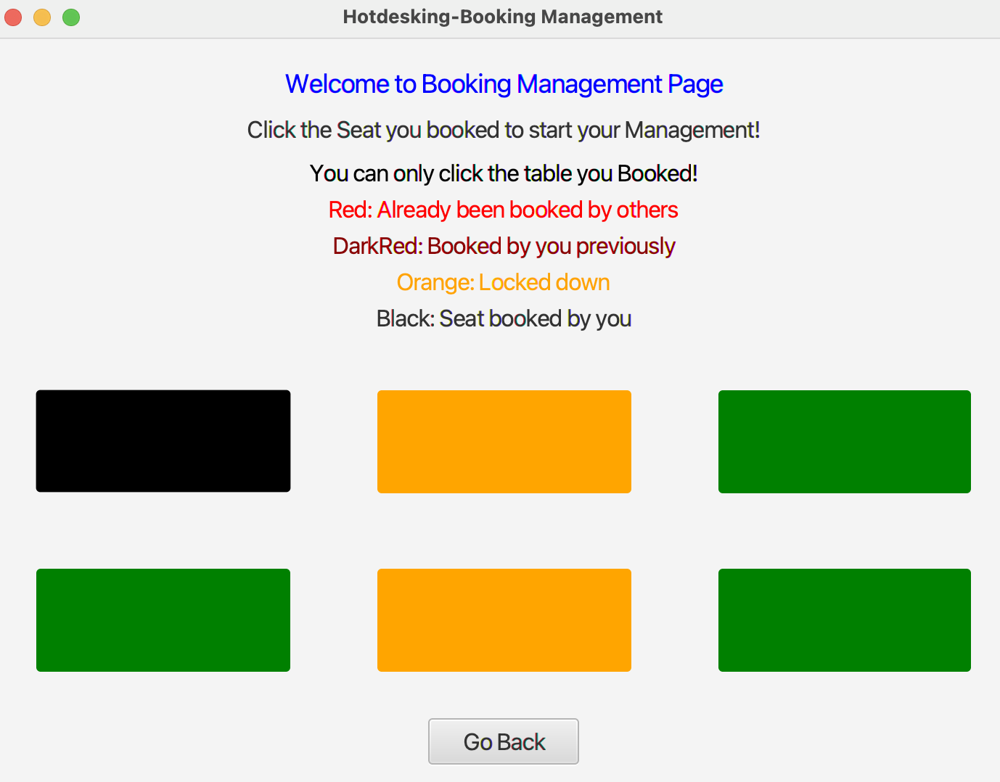
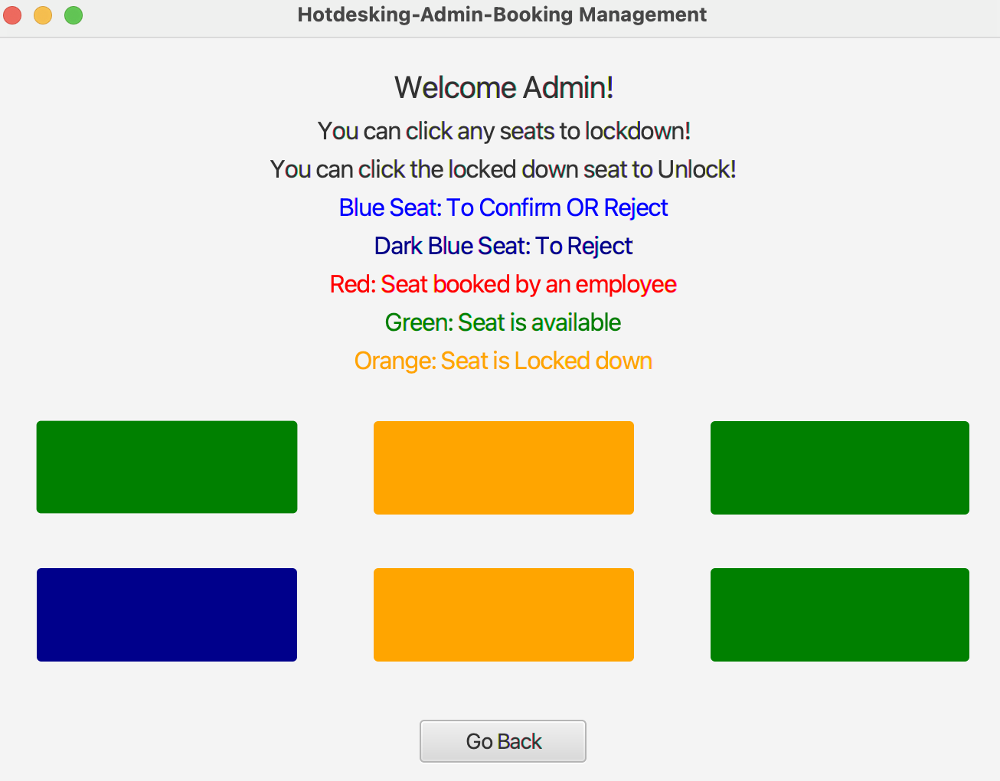
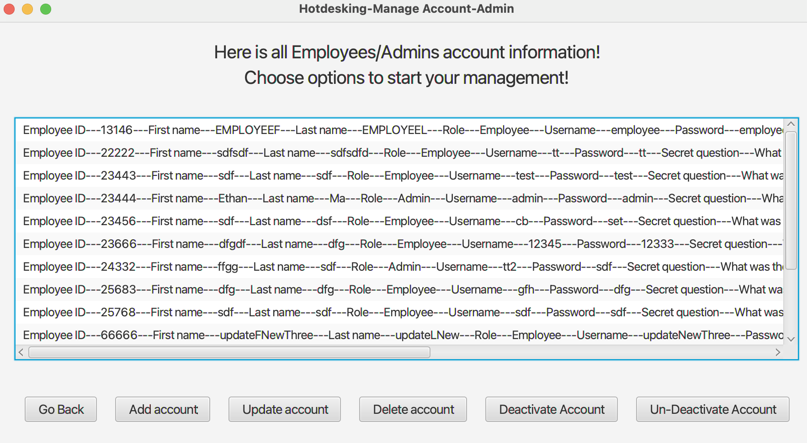

# Readme

- Name: Yitao Ma
- Student ID: s3843689
- Course Name: Further Programming (2110) COSC2391

#### All Functions required are completed and working without bugs.

### Content of the project:

- This project is about booking and manages booking systems. The employee can book a seat and manage their bookings. We
  also have an Admin role that can manage accounts, manage bookings, generate reports and manually change locked down
  seats. Each function also has other specific operations, you can discover them by yourself.

#### All functions are working.

#### DO NOT MODIFY/DELETE EXISTING DATA FOR BOOKING,WHITELIST,EMPLOYEE TABLE!!

- AS EXISTING DATA USED FOR UNIT TEST, IF CHANGED WILL CAUSE UNIT TEST AND FUNCTION PROBLEM.
- Current seat 2 and 5 is locked down, If you unlock the table and make new bookings will cause some unit tests failed.

#### Important! To run the unit tests first, then test the main functions, then unit tests will work fine. If you modified/add/delete existing data for all tables, Do not run unit tests! For example: I have a test delete an account then @Afterall method will add this account back after deletion, but if you delete this account through the main function, then the test will fail but @Afterall method will still execute then will add this account back.

#### To Test main functions:

- Register a new account and use that account to test employee functions.
- Add a new Admin account using existing another admin account (see functions notes below)
  to use "add functions" to add a new admin account, and you can test admin functions or just use the existing admin
  account.

#### Function Notes:

- Use a new employee/admin account to test all corresponding functions.
- BE CAREFUL with lock down function, most of the bookings are booked seat 1,4,6 if lock down these seats, most of the
  bookings will be deleted as this seat is locked down AND WILL IMPACT UNIT TEST BADLY! (since most of the bookings are
  been deleted.) So, better to run the unit test before modify/add/delete the existing account/seats/bookings through
  the main application. And after modify/add/delete the existing account/seats/bookings, don't run any unit tests. (
  especially if lock down a seat deleted some existing bookings)
- For Login: Depend on the employee's role, log in as employee or admin (To a different scene).
- Register only for Employee, not Admin.
- To test Employee function, you can register a new account or login using admin username and password to add an
  employee account. (Try not to modify/delete existing account and their bookings)
- To test Admin function, use Username: admin AND Password: admin
- Time validation framework for employee update and cancel function:
    - The employee can only update/cancel a specific booking 48 hours before the actual booking date, if the time from
      today to the actual booking date less than 48 hours, this employee can not update/cancel this booking.
- Employee Check-in function is independent, not related to other existing functions. Check-in is for the sake of
  contact tracing during the COVID-19 period, and it shows users actually sit on the desk for the period of booking.
  ( user can book but not go, but check-in is showing if the user used the desk or not and when).
    - Which, the user can not checkin if already checked in AND can not checkin if this booking/seat is not confirmed by
      the Admin.
- Lockdown: Period of operation. So, no date check. If a seat is locked down. All booking records AND corresponding
  Whitelist records for this locked downed seat will be cancelled/deleted if have any.
- Admin can achieve COVID-19 lockdown AND COVID-19 condition by manually lockdown selected seats.
- Admin Deactivate Account: (only deactivate employee account, not Admin) If an employee account is deactivated, this
  employee can not log in/reset password/ booking/manage booking, etc. Can not do all activities/operations.
- If a normal employee becomes admin then we still keep their previously booking records, but he/she can not make any
  operation related to the employee (booking/manage booking, etc).
- Admin Delete Account: If an account has been deleted, all records in Booking and Whitelist will also be deleted if
  have any.
- Admin update Account: If an account employee ID is updated. If this employee has bookings we also update their
  employee id in the Booking table and Whitelist table in the database.
- Time validation framework for Admin confirm booking function:
    - Every time you go to the Home page will do the time validation, so at the very beginning. if we have out of range
      bookings we will delete them, and their corresponding Whitelist records. If we don't have any out of range
      bookings, it's just not doing any operations. Which both employee and admin will see the newest updated data of
      bookings, any un confirmed and out of time bookings will be deleted.
- For Admin can manually change the Seat table (To change which seats to lockdown/unlock):
    - Like the Lockdown function, if a seat is locked down (status==true) if have bookings for this seat it will delete
      all and corresponding whitelist.

#### Database Notes:

- Employee table: Employee ID and Username is UNIQUE.
- Whitelist: If the Booking table has a record inserted, the Whitelist table also insert the same record automatically,
  but the date column is increment 1 day. The Purpose is to prevent the user to book the same sit that has been booked
  previously. So, it is to check which seat the user can not book at each date.
- Modify the Whitelist record is unnecessary! If the record changed in the Whitelist, will impact the function. DO NOT
  MODIFY IT. It is all down AUTOMATICALLY!
- (IMPORTANT!) So, For function: "Admin can manually change the Whitelist". It is actually changing the Seat table (
  Seats that is locked down) in the database instead of the Whitelist table in the database.

#### Unit Tests Notes:

- Run unit tests before modify/add/delete any existing accounts/bookings/seats through the add/delete/update functions
  And do not run unit tests after modify/add/delete existing accounts/bookings/seats through the add/delete/update
  functions.
- DO NOT modify/delete existing data in the database.
- You can do what ever you want with new created account, and their bookings (note: but lock down a seat will delete all
  booking records & whitelist records related to this seat)
- Model Unit Test: Employee ID: 77777 & 77778 & 88888 & 11111 used for test
    - DO NOT MODIFY THIS ACCOUNT AND RELATED BOOKING INFORMATION!!
    - If changed, Tests will fail.
    - If changed some of Locked down seats, tests will also fail in some cases.
- If Modify Seat Table, related tests will fail. (Like Test seat 5 is lock down originally, if you unlock it, some tests
  will fail.)
- Few model classes/methods is not tested either there are all void method, or it will actually impact the main function
  in some cases. (As I am not sure what sequence you going to check, just to make sure. So, if you do something with the
  lockdown seats through the lock down function then run the unit test, will actually cause for example database Seat 2
  originally is true which is locked down , but it becomes false when you unlock it which is not locked down now. but
  one of the test is to unlock it and use @Afterall method to update the unlock status for seat 2 to true. What happened
  is you unlock it and test set it to false but after all tests, it set back to true, but it is actually false as you
  unlock it. That will cause problem.)
  But, originally the functions is all working well unless you lock down or modify/add/delete any exiting
  accounts/bookings/seats AND run the unit tests.

#### Lock down notes:

- Currently, if you want to test lock down function, to lock down seat 3 will not impact unit tests and currently have 2
  booking records related to seat 3.
- It is not saying you can not lockdown other seats, all seats can be locked down but to lock down other seats will
  impact unit tests, and the unit test will impact actual functions, will make confusion.
- Just writ it again: Run unit tests before modify/add/delete any existing accounts/bookings/seats And do not run unit
  tests after modify/add/delete any existing accounts/bookings/seats. DO NOT modify/delete existing accounts/booking
  records/corresponding whitelist records and be careful with the lock down functions, most of the bookings related to
  seat 1,4,6, if lock down these seats, all bookings with these seats will be deleted. Unit tests will be impacted
  badly.

#### What steps need to be taken?

- Make sure you set the Java to Java 8 and detailed steps see
  "How to clone the project using intelliJIDEA and RUN the application" section.
- The main class is called "Main.java" You can directly run it.

# Packaging

The main class is Main.java

Packaging for classes:

- main.controller
- main.model
- main.ui
- Packaging for test:
- test.model

## How to clone the project using intelliJIDEA and RUN the application

1- Download IntelliJ IDEA Ultimate Version (You had to apply for student license)

2- Open IntelliJ IDEA, select "File" from the top menu, select "New" and select "Project from Version Control"

3- Copy your Github classroom repository and paste into URL, click on "Clone". Your project will be cloned and open in
your IntelliJ IDEA window.

However, you still need to add the SQLite jar file to your project so you can have access to your database. Follow next
steps for adding the Jar file:

1- Download the SQLite JDBC jar file from week 7 Canvas module.

2- In your project under project root, make a new directory called lib and move the jar file into lib folder

3- Open IntelliJ IDEA, click on "File", open "Project Structure"

4- Under "Project Setting", select "Libraries"

5- Click + button, choose Java, and navigate to your project folder, then Lib folder, choose "sqlite-jdbc-3.34.0.jar",
and click on "open"

6- Click on Apply and then OK to close the window

Now you are ready to Run the Application.

Simply right click on Main.java and choose Run. Congratulations!

Login info:

Username: test

Password: test

## Execution examples:

Home Page:

Login Page:

Register Page:

Employee Booking Page:

Employee Manage Booking Page:

Admin Manage Booking Page:

Admin Manage Accounts Page:

## Prepare other content

Readme files are made for developers (including you), but also could be used for the final users. So while you are
writing your readme files please consider a few things:

1. What is about?
    - Your name and student number and course name on the top
    - Describe the content of your project or repository
    - Explain things the users would have a hard time understanding right away
2. What steps need to be taken?
    - Any specific steps for running your application, what is the main class?
    - Is there any requirements or dependencies?
    - After the installation, how they compile or run the code?
3. Execution examples
    - You could provide examples of execution with code and screenshots

other things you could add:

- Table of content
- Test cases
- Know bugs
- Things that have not been working or complete

### References and tutorials for Readme (Markdown)

- **IntelliJ IDEA MarkDown guide**. jetbrains.com/help/idea/markdown.html
- **Choose an open source license**. Github. Available at: https://choosealicense.com/
- **Getting started with writing and formatting on Github**. Github. Available
  at: https://help.github.com/articles/getting-started-with-writing-and-formatting-on-github/
- **Markdown here cheatsheet**. Markdown Here Wiki. Available
  at: https://github.com/adam-p/markdown-here/wiki/Markdown-Here-Cheatsheet
- **Markdown quick reference**. Wordpress. Available at: https://en.support.wordpress.com/markdown-quick-reference/
- **readme-template**. Dan Bader. Github. Available at: https://github.com/dbader/readme-template
- Writing READMEs. **Udacity**. Available at: https://classroom.udacity.com/courses/ud777/
